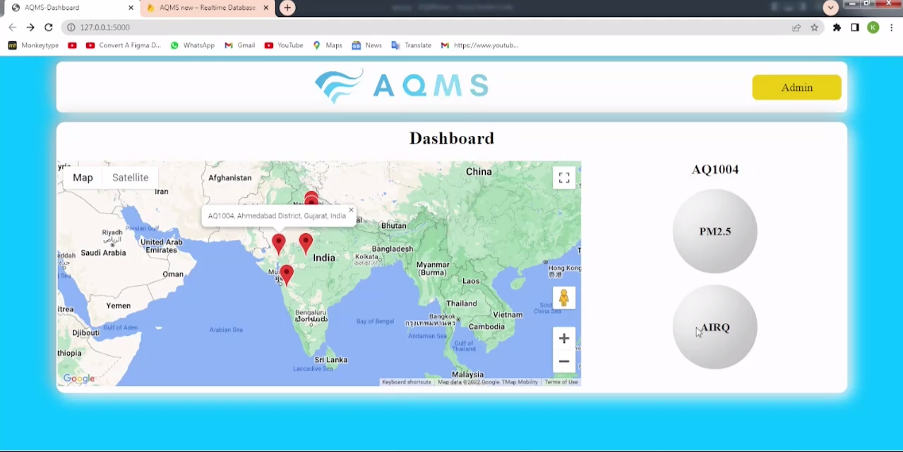

# AQMS - Air Quality Monitoring System

## Introduction

AQMS (Air Quality Monitoring System) is a hardware-software integrated project designed to monitor air quality using a combination of hardware sensors and a web application.

## Hardware Components

The hardware includes various sensors, such as PM2.5, that measure different parameters of air quality. These sensors work together to monitor the air quality in different parameters.

## Software Components

### Web Application

The software component of AQMS consists of a web application. This web application serves as a platform to deploy the hardware devices to various locations and display real-time data on a dashboard.

### Technologies Used

- **HTML:** Used for designing the website's templates.
- **CSS:** Responsible for styling the website and making it visually appealing.
- **JavaScript:** Provides dynamic features to the website, including interaction with Google Maps API and communication with the server.
- **jQuery:** Utilized for making AJAX requests for seamless data communication.
- **Flask (Python):** Serves as the backend server, managing interactions between the front end, Firebase, and hardware devices.
- **Firebase:**
  - **Realtime Database:** Stores and updates information related to various parameters measured by the AQMS hardware.
  - **Google Maps API:** Integrated with JavaScript to display location-based data on the dashboard.

### Functionality Overview

- HTML and CSS are responsible for the visual representation and styling of the web application.
- JavaScript provides dynamic features, like integrating with the Google Maps API to show location data.
- Flask handles the backend logic, including communicating with the Firebase Realtime Database and serving the web application to users.
- Firebase Realtime Database stores and updates the air quality data received from the hardware.
- AJAX requests are used to facilitate communication between the front end and Flask server, enabling real-time data updates.

## Demo

Check out the live demo video of AQMS web application:
[Demo Link](https://youtu.be/t6AHUPHr7og)

## Website Snapshots

  
  
  
  

## How it Works

1. The hardware sensors collect air quality data, including PM2.5 and other parameters.
2. The data is sent to the Flask server using POST requests.
3. Flask processes the data and updates the Firebase Realtime Database.
4. The web application fetches data from the Firebase Realtime Database and displays it on the dashboard in real time.
5. Users can interact with the dashboard to monitor air quality at different locations.

## Credits

This project was developed by Kamal Soni and Mukul Agrawal, inspired by the need to monitor the quality of the air surrounding us.
  
## Contact

Feel free to reach out to webdevkamal@gmail.com with any questions or inquiries.

Please note that this README provides an overview of the AQMS project. For detailed implementation steps and code examples, refer to the project's source code and documentation.

